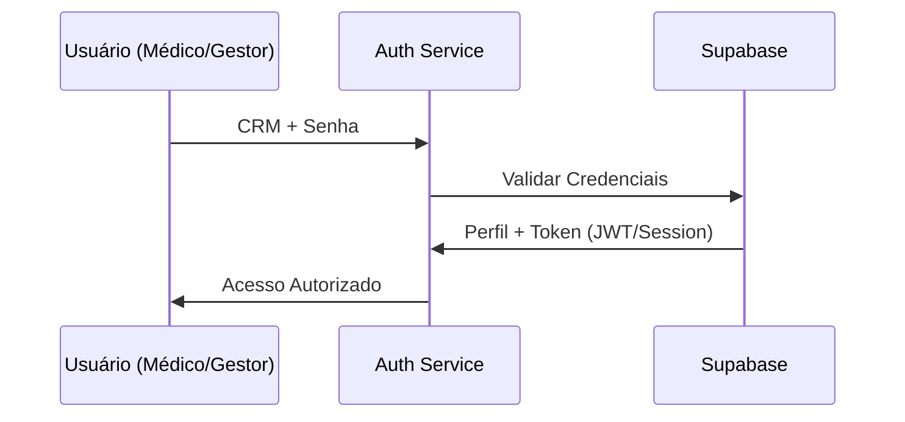

# Módulo: Auth (Authentication & Authorization)

## Visão Geral
Gerencia a identidade de Médicos e Gestores, garantindo acesso seguro via CRM/Senha e controlando permissões por unidade.

## Fluxo Lógico (Login)

## Contratos de Interface
- **`login(credentials)`**: Valida e retorna perfil do usuário.
- **`verifyPermissions(userId, unitId)`**: Checa se o usuário pode acessar dados de uma unidade específica.

## Dependências
- `Supabase Auth`: Provider de identidade.
- `api/AuthService.js` (Legado): Lógica a ser extraída.

## Compliance & Segurança
- [x] Senhas criptografadas no Supabase Auth.
- [x] Middlewares de proteção de rota por perfil.
