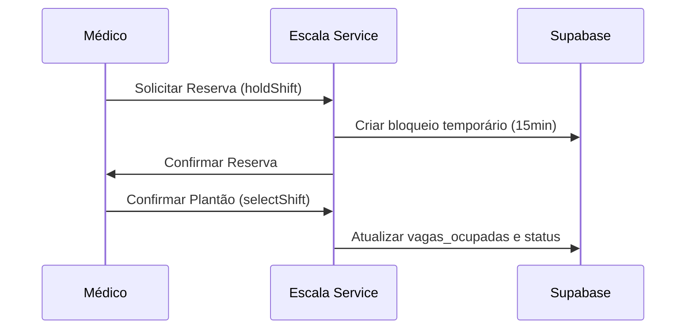

# Módulo: Escala (Shift Management)

## Visão Geral
Core business da aplicação, responsável pelo ciclo de vida de um plantão médico: criação, oferta, reserva, troca e confirmação.

## Fluxo Lógico (Reserva de Vaga)

## Contratos de Interface
- **`holdShift(id)`**: Bloqueia vaga por tempo limitado.
- **`selectShift(id, medicoId)`**: Efetiva a alocação do médico.

## Dependências
- `AuthModule`: Para validar identidade do médico.
- `DatabaseRepository`: Para persistência atômica.

## Compliance & Segurança
- [x] Prevenção de conflito de horário (overbooking).
- [x] Validação de CRM ativo.
