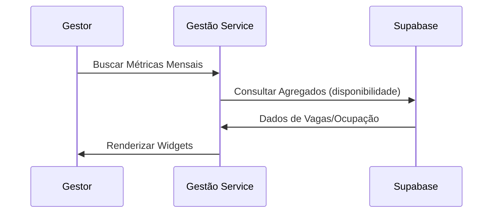

# Módulo: Gestão (Administration & Management)

## Visão Geral
Fornece aos administradores a visão consolidada da operação, permitindo gestão de acessos de médicos e unidades, acompanhamento de dashboards e auditoria de trocas.

## Fluxo Lógico (Dashboard Visão Geral)

## Contratos de Interface
- **`getDashboardMetrics()`**: Retorna ocupação por unidade e turno.
- **`manageDoctorAccess(id, unitId)`**: Habilita/Desabilita médico em unidade.

## Dependências
- `EscalaModule`: Para leitura de ocupação.
- `AuthModule`: Para validar permissão administrativa.

## Compliance & Segurança
- [x] Logs de exclusão de usuários médicos.
- [x] Proteção contra SSRF e Injeção SQL em queries analíticas.
