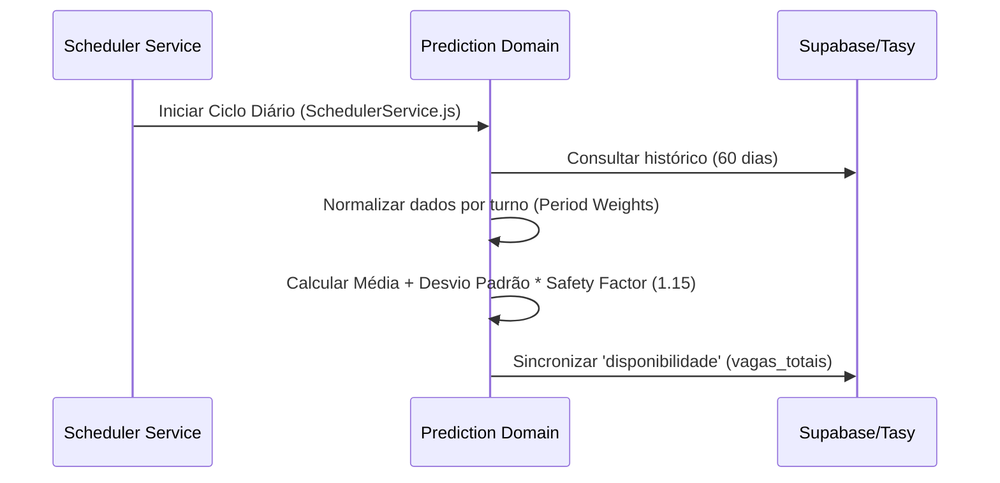

# Módulo: Predição (Demand Forecasting)

## Visão Geral
Responsável pelo cálculo analítico da necessidade de médicos por turno, baseando-se no histórico de atendimentos Tasy e em heurísticas operacionais (fatores de segurança, pesos por turno e sazonalidade de feriados).

## Fluxo Lógico (Geração de Necessidade)

## Contratos de Interface

### Inputs
- **`unidade_id`**: Identificador único da unidade de saúde.
- **`date_range`**: Janela de histórico (padrão: 60 dias).

### Outputs
- **`prediction_grid`**: Matriz contendo data, período e `vagas_totais` recomendadas.

### Exceptions
- **`InsufficientHistoryError`**: Quando a unidade possui menos de 7 dias de dados no histórico.
- **`DatabaseConnectionError`**: Falha ao acessar o Supabase.

## Dependências
- **`config/env`**: Para chaves de API e variáveis de scheduler.
- **`model/dbModel`**: Para persistência das vagas e leitura do histórico.
- **`model/analise_feriados.json`**: Consultas a regras de datas específicas.

## Compliance & Segurança
- [x] Ocultação de dados sensíveis (pacientes/médicos) durante o processamento das médias.
- [x] Logs de auditoria para recalculos manuais solicitados pelo gestor.
